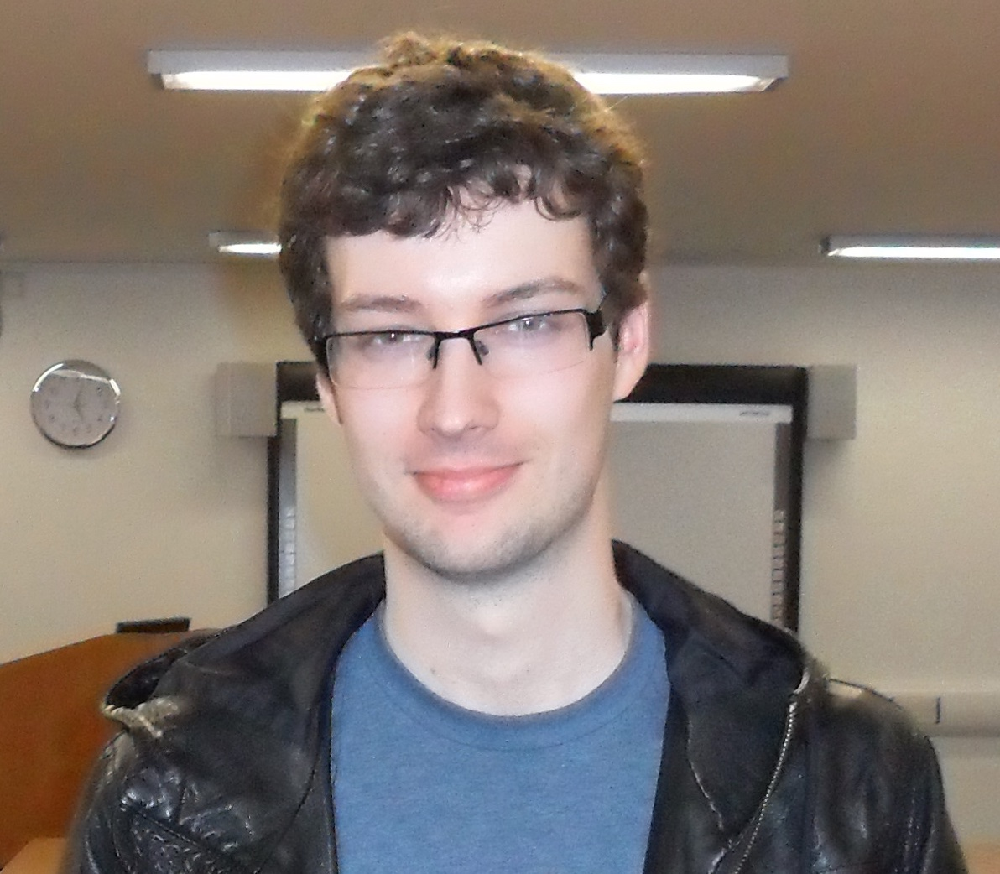

<h1 align="center" style="color:#64548C;"> Keynote Speakers </h1>
Our Keynote Speakers will present the latest research on Open Data and related applications.

## Vittorio Scarano

{: width="350px"}

[Vittorio Scarano](https://docenti.unisa.it/001717/en/home){:target="_blank"} is a Full professor of Computer Science at the Computer Science Department of University of Salerno in Italy. 
He has been visiting the University Eotvos Lorand in Budapest (Hungary) and he has visited the Department of Computer Science at the University of Massachusetts at Amherst (USA).
Since 1996, he  funded and co-directs the ISISLab laboratory within the Department. ISISLab has been hosting, until now, the research activity of 23 PhD students, actually employing more than 20 collaborators (grants, fellowships) with involvement in research project at local, regionale, national and european level. 
He is co-author of more than 150 papers in internationally refereed journals and conferences of IEEE, ACM, etc..
He coordinated the European funded research H2020 project ROUTE-TO-PA "Raising Open and User-friendly Transparency-Enabling Technologies fOr Public Administrations" (grant agreement No 645860) with 12 partners and a budget above 3M€. He has participated and coordinated local units in European (FP6, Leonardo, Erasmus+), national and regional funded research and innovation projects.
He likes family, doing research and teaching, in this order.

<!-- ### Title: Co-creation of Open Data: Open Data of the citizens, by the citizens, for the citizens!
 
Open data is data that is freely available to everyone to use and republish as they wish, without any kind of restrictions, be it copyright, patents or any other mechanisms of control. It is recently become a very important innovation for the Public Administration and citizens in order to improve the transparency and the awareness of the relationship government-citizens.

The seminar will describe the experiences generated by the EU H2020 Project ROUTE-TO-PA,  multidisciplinary innovation project, that, by combining expertise and research in the fields of e-government, computer science, learning science and economy, is aiming at improving the impact, towards citizens and within society, of ICT-based technology platforms for transparency.

The main objective of the project was to improve the engagement of citizens by making them able to socially interact over open data, by forming or joining existing online communities that share common interest and discuss common issues of relevance to local policy, service delivery, and regulation; citizens are also empowered to co-create open datasets, thereby becoming authors and actors in the Open Data ecosystem, rather than simple (maybe even advanced) users.

We will illustrate the guidelines of the project, the Social Platform for Open Data (SPOD) created by the project and several examples of real communities that are using the outcomes of the project, even 3 years after the end of the project. In particular we will describe the experience of HETOR (www.hetor.it) where communities are collectively creating knowledge (in the form of open datasets) about the local cultural heritage, collecting materials, oral traditions, and recollections of their local history. Finally we will explore how, by using Linked Open Data, it is possible to simply create a Virtual Exhibition from personalized requirements.

Acknowledgments: Most part of the work was supported by the grant of EU Horizon 2020 project ROUTE-TO-PA. We thank all the researchers of the ROUTE-TO-PA project for very interesting and useful discussions. We also thank all the participants of the project and all the citizens and organizations that collaborated in the use cases. -->

<h1 align="center" style="color:#64548C;"> Panel Speakers </h1>
Our panel sessions will include various speakers from various organisations producing, managing and using Open Data in various domains.

  
  
Richard Nevell, Wikimedia UK

  
  
Jason Evans, The National Library of Wales

